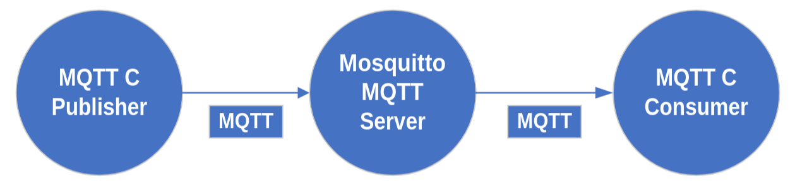
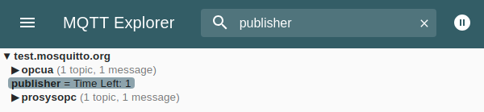

# MQTT Mosquitto C Tutorial

This project contains the code for the tutorial about MQTT and Mosquitto made during my curricular end-of-studies internship at CATEC.


<!-- 
This, according to Creative Commons, is a photo of Mosquitto. Do whatever you want with it.

-->

## Dependencies

To use the code in this repository, certain dependencies and third-party programs are needed. The code was tested on <em>Ubuntu 20.04</em>.

For *nix systems, CMake creates Makefiles. The build process requires the following tools:
- CMake v3.5 or newer
- Fully compatible C++ 11 compiler

The following commands are required for the correct functioning of the <em>Paho MQTT C++</em> library, which will be used for this project. 
```
# Instalation of prerequisites for MQTT
sudo apt-get install build-essential gcc make cmake cmake-gui cmake-curses-gui
sudo apt-get install libssl-dev
sudo apt-get install doxygen graphviz
```

Before building the C++ library, first, build and install the Paho C library, if not already present. Note, this version of the C++ library requires Paho C v1.3.13 or greater. It can be done as it follows:
```
# Clone and build of Paho MQTT C repository
cd && git clone https://github.com/eclipse/paho.mqtt.c.git
cd paho.mqtt.c
git checkout v1.3.13
cmake -Bbuild -H. -DPAHO_ENABLE_TESTING=OFF -DPAHO_BUILD_STATIC=ON -DPAHO_WITH_SSL=ON -DPAHO_HIGH_PERFORMANCE=ON
sudo cmake --build build/ --target install
sudo ldconfig
```

Building the C++ repository into a library can be done as it follows. 
```
cd && git clone https://github.com/eclipse/paho.mqtt.cpp
cd paho.mqtt.cpp

cmake -Bbuild -H. -DPAHO_WITH_MQTT_C=ON -DPAHO_BUILD_STATIC=ON -DPAHO_BUILD_DOCUMENTATION=ON -DPAHO_BUILD_SAMPLES=ON
sudo cmake --build build/ --target install
sudo ldconfig
```

#### Optional installations

This is MQTT Explorer, a software that can be used for testing and checking MQTT. It can be downloaded from the following link as an AppImage: <a href="https://github.com/thomasnordquist/MQTT-Explorer/releases/download/0.0.0-0.4.0-beta1/MQTT-Explorer-0.4.0-beta1.AppImage" target="_blank" rel="noreferrer">MQTT-Explorer.AppImage</a>, directly from the Ubuntu Software Store or from the following command.
```
sudo snap install mqtt-explorer
```
Another downloaded software is Wireshark. This is NOT recommended for testing, but it can be useful for checking the flow of packages from your computer.
```
sudo apt install wireshark
```

## Usage

First of all, cloning the repository is mandatory to continue with the rest of the instructions here.
```
git clone https://github.com/SDuSDi/MQTT-Mosquitto-C-Tutorial.git
cd MQTT-Mosquitto-C-Tutorial
```
For the usage of this repository, it is NOT necessary to compile or build the code. If needed, the following commands show how it can be done.
```
cd build/
cmake ..
cmake --build .
```
The next commands are the publisher (it produces and sends the messages to the server) and the consumer (that subscribes, reads and "consumes" the message from the server). For simplicity, we recommend executing both the publisher and the consumer on different terminals, so the results of both can be easily seen.
```
#Command for the producer/publisher
./publisher

#Command for the consumer/subscriber
./consumer
```
If you have <em>MQTT Explorer</em> installed, you can see the messages publised in the server <em>test.mosquitto.org</em>. The port in which it is published is 1883. You can search tne name of the topic on the search bar on top. It is called "publisher".



This way you can use it to test you publisher and subscriber, since you can even sen messafes from Explorer to the topic the subscriber is listening.

## Diving Deeper

- https://github.com/eclipse/paho.mqtt.cpp
- https://makesomeshit.com/how-to-mqtt-in-cpp-c

## Reach Out

Brais Martínez -> bmartinez.ext@catec.aero 

<!--
This is an html comment 

Plans that I dont want showing up:

- This
- That

-->